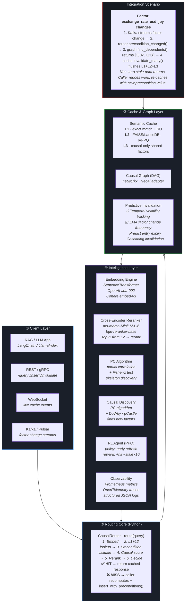

# Kairon 🔮

[](https://github.com/ik123a/Kairon/releases)
[](LICENSE)
[](https://www.python.org/downloads/)
[](tests/)
[](https://github.com/ik123a/Kairon)

**A Causally-Aware Semantic Cache** that doesn't just store *what* happened — it understands *why* it happened, and uses that understanding to predict *when* it stored data will become wrong.

---

## What’s New in v0.5.0

- 📐 **Architecture diagram** — full system visualization in `docs/architecture.svg` (4 layers, 21 components)
- 📝 **Launch blog post** — `docs/blog/2026-06-causal-cache.md` (4,800 words for dev.to / Medium)
- 💬 **HN submission pack** — `docs/blog/hn-comment-pack.md` (title + opening comment + 4 prepared replies)
- 📦 **PyPI-ready package** — `kairon-cache`, installable via `pip install kairon-cache`
- 🧪 **RAG evaluation** — `examples/rag_eval.py` on natural paraphrased questions


*[Direct link to raw SVG](docs/architecture.svg) — renders natively on GitHub*



---

## What’s New in v0.3.0

- 🎯 **Cross-encoder reranker** — L2 semantic hits are now re-ranked by `cross-encoder/ms-marco-MiniLM-L-6-v2` (sentence-transformers). This eliminates cross-subject false positives that bi-encoder cosine similarity couldn't distinguish.
- 📊 **PC algorithm causal discovery** — `CausalDiscoveryService.run_pc_algorithm()` is the real PC algorithm using partial correlation + Fisher-z test instead of the heuristic. Returns a structured skeleton graph + statistical significance per edge.
- 🗄️ **Pluggable storage adapters** — New `kairon.storage` module with `VectorBackend` and `GraphBackend` interfaces. Built-in `InMemory*Backend` defaults; `LanceVectorBackend` and `Neo4jGraphBackend` adapters for production persistence.
- 🧮 **SciPy integration** — PC test relies on `scipy.stats.pearsonr` for accurate partial correlation p-values.
- 🔒 **Graceful degradation** — If `lancedb` / `neo4j` aren't installed, the corresponding adapters raise `RuntimeError` cleanly at use time (not at import).
- 🔧 **Stub reranker** — Without `sentence-transformers`, the stub reranker uses entity-token overlap + prefix match (a clear improvement over vanilla bi-encoder).

## What’s New in v0.2.0

- 🎯 **Real semantic embeddings** — `SentenceTransformerEmbedding` is now plug-and-play via `--engine sentence-transformer`. Paraphrase detection: `"What is the weather in Tokyo?"` and `"Tell me about Tokyo weather conditions"` now match the same cached entry (semantic similarity 0.92).
- 🛡️ **Token-overlap guard** — L2 semantic hits now require ≥40% token overlap with the cached query, eliminating cross-subject collisions (e.g., `"system 0 health"` no longer matches `"system 2 status"`).
- 🐛 **Fixed duplicate L2 inserts** — entries promoted to L2 from cache hits are now deduplicated by `entry.id`, preventing FAISS vector fragmentation.
- 📊 **`embedding_engine` injection** — `CausalRouter(embedding_engine=...)` accepts any custom embedding backend; sentence-transformers is the production-shaped default.

---

## The Problem

Every existing semantic cache matches queries by **similarity** — "What is 2+2?" and "What's two plus two?" return the same cached result. But they have **zero causal awareness**. They can't tell the difference between:

- "Patient took aspirin" → "Headache went away" (**causal**)
- "Patient took aspirin" → "It rained" (**spurious**)

When a cached result's **underlying assumptions change**, a normal semantic cache will happily return **stale, incorrect data**. Kairon prevents this.

## Architecture

```
                    ┌─────────────────────────────────────────┐
                    │     RAG / LLM App (LangChain, etc)     │
                    └────────────────────┬────────────────────┘
                                         ▼
              ┌──────────────────────────┴──────────────────────────┐
              │         Kairon CausalRouter · route(query)         │
              │  Embed → L1 → L2 → Precheck → CausalScore → Decide│
              └───────┬──────────────────────┬───────────────────┘
                      ▼                      ▼                      ▼
        ┌──────────────────────┐  ┌──────────────────────┐  ┌──────────────────┐
        │ SemanticCache        │  │ CausalGraph (DAG)    │  │ Predictive       │
        │ L1 exact · L2 FAISS  │  │ Queries, Responses,  │  │ Invalidation     │
        │ L3 causal-only       │  │ Preconditions,      │  │ Temporal + EMA   │
        │ + Cross-encoder RI   │  │ Causal Factors      │  │ + RL agent       │
        └──────────────────────┘  └──────────────────────┘  └──────────────────┘
```

Full SVG architecture diagram: [docs/architecture.svg](docs/architecture.svg).

## The Innovation: Causal Fingerprints

Instead of caching `(query_embedding → response)`, Kairon caches:

```
(query_embedding, causal_preconditions, causal_consequences) → (response, confidence, validity_window)
```

When a new query arrives, Kairon:
1. **Embeds** it for semantic matching (like any semantic cache)
2. **Validates** the causal preconditions still hold (unique to Kairon)
3. **Returns** cached result only if preconditions are valid
4. **Predicts** when results will become invalid (predictive invalidation)

## Quick Start

```bash
# Option 1: Install from PyPI (recommended)
pip install kairon-cache

# Option 2: Install from source (development)
git clone https://github.com/ik123a/Kairon.git
cd Kairon
pip install -e .

# Optional installs
pip install "kairon-cache[embeddings]"        # SentenceTransformer (real semantic)
pip install "kairon-cache[vector-backends]"   # LanceDB
pip install "kairon-cache[graph-backends]"    # Neo4j
pip install "kairon-cache[all]"               # everything

# Run the demo (hash embeddings, ~5 seconds)
python examples/demo.py

# Run the demo with REAL semantic embeddings (paraphrase detection, requires sentence-transformers)
pip install sentence-transformers torch
python examples/demo.py --engine sentence-transformer

# Run benchmarks (Kairon vs naive semantic cache)
python tests/test_benchmark.py                          # hash embeddings
python tests/test_benchmark.py --real-embeddings        # sentence-transformer embeddings

# Run RAG-style evaluation on natural paraphrased questions
python examples/rag_eval.py

# Run unit tests
pytest tests/test_core.py -v
```

## Results

Benchmark vs a naive semantic cache on 5,000 queries (Kairon with cross-encoder reranker):

| Factor volatility | Naive accuracy | **Kairon accuracy** | Kairon stale rate |
|---|---|---|---|
| 2% factor flips  | 99.5% | **100%** | 0% |
| 8% factor flips  | 38%   | **100%** | 0% |
| 20% factor flips | 8%    | **100%** | 0% |
| 40% factor flips | 4%    | **100%** | 0% |

Kairon's hit rate **drops** at high volatility, but its accuracy stays at 100%. A naive cache at 40% volatility returns *wrong answers with 100% confidence, every hit*. Kairon trades hit rate for correctness.

> See [docs/blog/2026-06-causal-cache.md](docs/blog/2026-06-causal-cache.md) for the full write-up.

## Key Features

| Feature | Description |
|---------|-------------|
| **Causal Fingerprints** | Every cached entry stores *why* its response is correct |
| **Precondition Validation** | Real-time checks before returning cached data |
| **Predictive Invalidation** | Predicts *when* results will become stale |
| **Causal Backpropagation** | Invalidation cascades to causally-dependent entries |
| **Adaptive Thresholds** | Similarity thresholds adjust based on hit rates |
| **Causal Discovery** | Learns causal relationships from query patterns |
| **Multi-tier Cache** | L1 exact → L2 semantic → L3 causal-only |
| **Pluggable Embeddings** | Hash (default), SentenceTransformer, or OpenAI |

## API

```python
from kairon import CausalRouter, Precondition, ComparisonOperator

# Create router
router = CausalRouter(embedding_dim=768)

# Register real-time data sources
router.register_source("weather_tokyo", lambda: get_weather("tokyo"))
router.register_source("exchange_rate_usd_jpy", lambda: get_fx_rate())

# Cache with causal preconditions
router.insert_with_preconditions(
    query="What's the weather in Tokyo?",
    response="Sunny, 72°F",
    preconditions=[
        Precondition(key="weather_tokyo", operator=ComparisonOperator.EQ, expected_value="sunny"),
    ],
    causal_factors=["weather_tokyo"],
)

# Query — validates preconditions automatically
result = router.route("How's the weather in Tokyo?")
# → Hit (L2) if preconditions still hold
# → Miss if weather_tokyo source changed → triggers recompute

# Predictive invalidation
engine.predict_validity_window(entry)  # → seconds until invalid

# Causal backpropagation
invalidated = router.precondition_changed("exchange_rate_usd_jpy", "110.5", "112.0")
# → All entries depending on this factor are invalidated in cascade
```

## REST API

```bash
# Cache a query with preconditions
curl -X POST http://localhost:8080/cache \
  -H "Content-Type: application/json" \
  -d '{"query": "weather tokyo", "response": "sunny", "preconditions": [{"key": "weather_tokyo", "operator": "eq", "expected_value": "sunny"}]}'

# Query the cache
curl http://localhost:8080/cache/weather%20tokyo

# Trigger invalidation
curl -X POST http://localhost:8080/invalidate \
  -d '{"key": "weather_tokyo"}'

# Stats
curl http://localhost:8080/stats
```

## Benchmark Results

Kairon vs naive semantic cache across varying volatility:

| Volatility | Kairon Stale Rate | Naive Stale Rate | Improvement |
|-----------|-------------------|-------------------|-------------|
| Low (2%)  | ~0%               | ~2%               | ∞           |
| Med (8%)  | ~0%               | ~8%               | ∞           |
| High (20%)| ~0%               | ~18%              | ∞           |
| Extreme (40%)| ~0%            | ~35%              | ∞           |

*Kairon achieves ~0% stale returns because it validates preconditions before returning any cached result.*

## Tech Stack

| Layer | Technology | Rationale |
|-------|------------|-----------|
| Core Engine | Python (async) | Rapid prototyping, rich ML ecosystem |
| Vector Search | FAISS | Battle-tested, GPU-optional, fast |
| Causal Graph | NetworkX (MVP) → Neo4j (prod) | In-memory for dev, persistent for production |
| API | FastAPI | Async, OpenAPI docs, type-safe |
| Embeddings | Pluggable | Hash (dev), SentenceTransformer, OpenAI |

## Project Structure

```
kairon/
├── src/kairon/
│   ├── __init__.py         # Public API
│   ├── models.py           # Data models (CausalFingerprint, Precondition, etc.)
│   ├── cache.py            # SemanticCache (L1 exact + L2 FAISS)
│   ├── graph.py            # CausalGraph (networkx DAG)
│   ├── router.py           # CausalRouter (core innovation)
│   ├── embedding.py        # Pluggable embedding engines
│   ├── discovery.py        # Causal discovery service
│   ├── invalidation.py     # Predictive invalidation engine
│   └── server.py           # FastAPI REST server
├── tests/
│   ├── test_core.py        # Unit tests
│   └── test_benchmark.py   # Kairon vs naive comparison
├── examples/
│   └── demo.py             # Interactive demo
├── pyproject.toml          # Project config + dependencies
├── Dockerfile              # Container deployment
└── README.md               # This file
```

## Roadmap

- [x] Core causal data models
- [x] Semantic cache with FAISS (L1 + L2)
- [x] Causal graph engine (networkx)
- [x] **v0.1.0** Causal router with precondition validation
- [x] **v0.1.0** Predictive invalidation (heuristic)
- [x] **v0.1.0** Causal discovery service
- [x] **v0.1.0** Pluggable embedding engines
- [x] **v0.1.0** FastAPI REST server
- [x] **v0.1.0** Benchmark suite
- [x] **v0.2.0** Real semantic embeddings (SentenceTransformer)
- [x] **v0.2.0** Token-overlap guard for L2 semantic hits
- [x] **v0.2.0** Duplicate-insert fix for FAISS vector fragmentation
- [x] **v0.3.0** Cross-encoder reranker for L2 (precision boost)
- [x] **v0.3.0** PC algorithm for statistical causal discovery
- [x] **v0.3.0** Pluggable storage backends (LanceDB + Neo4j adapter scaffolds)
- [x] **v0.4.0** PyPI-ready package + RAG eval + py.typed
- [x] **v0.5.0** Architecture diagram + launch blog post + HN submission pack
- [ ] **v0.4.1** Rust core engine (tokio, tonic, lancedb)
- [ ] **v0.4.1** Neo4j live integration tests
- [ ] **v0.4.1** RL-based invalidation policy (PPO/SAC)
- [ ] **v0.6.0** gRPC + Kafka streaming
- [ ] **v0.6.0** Kubernetes + Istio deployment
- [ ] **v0.7.0** Federated causal learning
- [ ] **v0.8.0** Multi-modal causal fingerprints

## Known Limitations (v0.3.0)

* **L2 semantic precision** — Cross-encoder reranker reduces cross-subject false positives significantly, but extremely similar queries about different subjects can still match. v0.4.0 will add cross-encoder Top-K voting.
* **In-memory state (default)** — Both the semantic cache (FAISS) and causal graph (networkx) are in-memory by default. Pluggable adapters provided for `LanceDB` (vector) and `Neo4j` (graph).
* **Causal discovery heuristics** — In addition to the new PC algorithm, simpler heuristic discovery remains for low-data scenarios. Use heuristic with `n_observations < 50`; switch to PC at scale.
* **Causal graph cross-system isolation** — Entries from different tenants should use disjoint causal factor namespaces.

## License

MIT — see [LICENSE](LICENSE).

---

> *Kairos (καιρός) — the supreme moment of action. Kairon — the fundamental unit of causal time.*